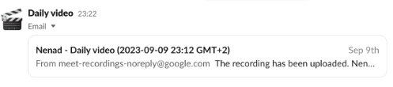
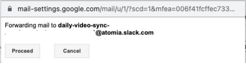
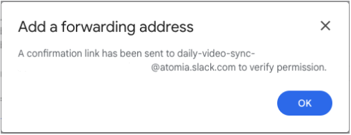

# Recording "Daily video" automation
The process of recording a daily video of the work done for a particular day is an important process thus this solution eases the steps necessary to fulfill this requirement.

## Usage
1. `User` joins the meeting from a **Google Calendar** event *"[Name] - Daily video"*
1. `User` manually clicks the **Google Chrome Bookmark** to start the recording or it is already configured to run automatically via **Google Chrome Addon**
1. The User selects which screen to present in the **Google Meet**

The result of these few clicks is that **Google Meet** is started, with a screen to present, the video is recorded, the audio is transcribed (for a seachable text content), recording and transcription are uploaded to **Google Drive**, with uploaded links sent to **Gmail** and to **Slack** `#channel`.

## Details

1. **Google Calendar** notifies the User to record *"[Name] - Daily video"*
2. `User` opens the meeting from a **Google Calendar** event *"[Name] - Daily video"* with `"Join with Google Meet"`
    1. Optionally, add an additional recap for the particular day to the event title
3. The **Google Meet** event and recording is started with:
    1. **Google Chrome Bookmark** (manually by the `User`) via [bookmark.js](https://github.com/troxohq/google-meet-auto-recording/blob/main/bookmark.js)
    2. **Google Chrome Addon** (automatically) via [addon.js](https://github.com/troxohq/google-meet-auto-recording/blob/main/addon.js)
4. The User joins the **Google Meet** event and recording and transcribing are automatically started
   1. The User selects which screen to present in the **Google Meet**
5. **Google Meet** stores the recording and transcription files to **Google Drive**
6. **Google Meet** automatically sends an email to **Gmail** inbox of the User when the recorded video and its transcription are ready
7. **Gmail** inbox's rule automatically filters the matching *"[Name] - Daily video"* email and forwards it to the inbox of the **Slack**
 `#channel`
1. **Slack** shows the message with *"[Name] - Daily video"* recording links to the for the particular **Google Calendar** event date in the `#channel`

## Installation

### 1. Reminder configuration
Create a recurring Google Calendar event (each workday at e.g. 17:00) with a title e.g. *"Nenad - Daily video"* and add Google Meet to this initially scheduled meeting with `"Add Google Meet video conferencing"`.

### 2. Recording automation

#### Option 1: Manually start any recording
Add the content of the script [bookmark.js](https://github.com/troxohq/google-meet-auto-recording/blob/main/bookmark.js) to the
**Google Chrome** bookmark (i.e. bookmarklet)
  * Leave `recordOnlyIfIncludes` as `undefined` at [bookmark.js#L2](https://github.com/troxohq/google-meet-auto-recording/blob/main/bookmark.js#L2) to allow recording of any Google Calendar event, not only e.g. *"Daily video"*

#### Option 2: Automatically start a *"Daily video"* recording
Add the content of the script [addon.js](https://github.com/troxohq/google-meet-auto-recording/blob/main/addon.js) to the **Chrome Addon** that injects and executes JavaScript code:
  * Configure `recordOnlyIfIncludes` at [addon.js#L1](https://github.com/troxohq/google-meet-auto-recording/blob/main/addon.js#L1) to match the Google Calendar event title, e.g. *"Daily video"*
  * Addons that can be used:
     * [Chrome Addon - User JavaScript and CSS](https://chrome.google.com/webstore/detail/user-javascript-and-css/nbhcbdghjpllgmfilhnhkllmkecfmpld)
     * [JScript tricks](https://chrome.google.com/webstore/detail/jscript-tricks/odialddippdmebbfbflcneemfdglimod)
     * [Scripty - Javascript Injector](https://chrome.google.com/webstore/detail/scripty-javascript-inject/milkbiaeapddfnpenedfgbfdacpbcbam)
     * [InjectCode](https://chrome.google.com/webstore/detail/injectcode/flhghpihapijancfhnicbnjifdodohpi)

### 3. Google Drive recordings permission
The **Google Meet** video and transcription recordings are stored in a `User` **Google Drive** folder `Meet Transcript`:
  * Share this folder with relevant people who will have access to all recordings

### 4. Slack notification receiver
Configure (if not already defined) **Slack** `#channel` => "Integrations" => "Send emails to this channel" to receive the emails to pass them through as messages to a channel.

Configure "Customize  Email Appearance" to look like this:

### 5. Gmail notification sender
Configure Gmail to forward the recording (and transcription) emails to Slack inbox and optionally apply a separate label:
1. Open https://mail.google.com/#settings/filters
2. Click `Create a new filter`
3. Set `From` to "meet-recordings-noreply@google.com"
4. Set `Subject` to "Daily video"
5. Click `Create filter`
6. Set `Forward it to` to the email address connected to the **Slack** `#channel`
7. Optionally  check `Mark as read` and/or both `Skip the Inbox (Archive it)`, and `Apply the label:` to organize these emails

The target forwarding email needs to be approved by clicking the link in from the confirmation message sent to **Slack** `#channel`.

## Remarks
### 1. English language only
The script expects that **Google Meet** operates in English because the handlers are sensitive to the appearance of the predefined terms on the web page.

The default setup expects that the **Google Calendar** event has a *"Daily video"* in its title since the code by default will rely on its existence (can be changed in JS content for **Google Chrome Bookmarklet** or **Google Chrome Addon**). The additional recording explanation can be added to that event title for the particular day only.

### 2. Script deployment improvements
The script content is deployed manually by the user - either in a **Google Chrome Bookmarklet** or in the **Google Chrome Addon**.

To ease the development and deployment cycles, the script content can be dynamically loaded to the **Google Chrome Addon** by loading the script content via AJAX and adding it to the `<html></html>` tag. This approach will not work for **Google Chrome Bookmarklet** because of the browser security restrictions

### 3. Permissions improvements
**Google Drive** folder needs to be shared with people who should watch the video, or permissions should be set for each recording separately.

A potential fix would be a **Google Apps Script** that will automatically either:
* Move *"Daily video"* recordings to another **Google Drive** folder with specified permissions.
* Or set permissions explicitly per meeting attendees.

### 4. Google Chrome support only
The script is tested only with **Google Chrome** and its **Chrome Addons**.
