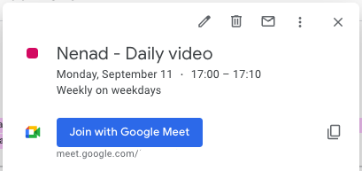
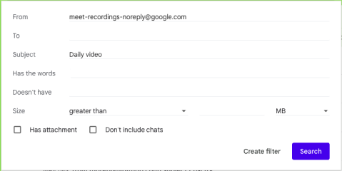
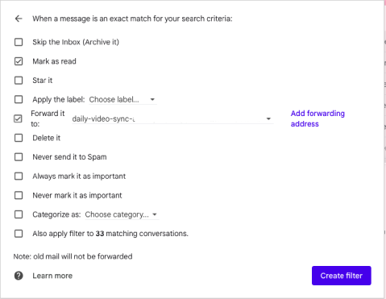

# Recording "Daily video" automation
The process of recording a daily video of the work done for a particular day is an important process thus this solution eases the steps necessary to fulfill this requirement.

## Usage
1. **Google Calendar** notifies the User to record *"[Name] - Daily video"*
1. `User` opens the meeting from a **Google Calendar** event *"[Name] - Daily video"*
1. The **Google Meet** event and recording is started with [process.js](https://github.com/troxohq/google-meet-auto-recording/blob/main/process.js) via 
    * **Google Chrome Bookmark** (manually by the `User`)
    * **Google Chrome** Addon** (automatically)
1. The User joins the **Google Meet** event and recording and transcribing are automatically started
1. **Google Meet** stores the recording and transcription files to **Google Drive**
1. **Google Meet** automatically sends an email to **Gmail** inbox of the User when the recorded video and its transcription are ready
1. **Gmail** inbox's rule automatically filters the matching *"[Name] - Daily video"* email and forwards it to the inbox of the **Slack** 
 `#channel`
1. **Slack** shows the message with *"[Name] - Daily video"* recording links to the for the particular **Google Calendar** event date in the `#channel`

## Installation

### 1. Reminder configuration
Create a recurring Google Calendar event with a title e.g. *"Nenad - Daily video"* and add Google Meet to this scheduled meeting.

### 2. Recording automation
Add the content of the script [process.js](https://github.com/troxohq/google-meet-auto-recording/blob/main/process.js) to the:
  * **Google Chrome** bookmark (i.e. bookmarklet) - Manual click to start a recording
  
    
  * **Chrome Addon** to inject and execute JavaScript code - Automatically start a recording:

    
	* Configure `autoStartRecordingFor` at [process.js#L7](https://github.com/troxohq/google-meet-auto-recording/blob/c79aeac4eaa191543e492fe1dbb7e465e4a0d510/process.js#L7) to match the Google Calendar event title, e.g. *"Daily video"*.
    * [Chrome Addon - User JavaScript and CSS](https://chrome.google.com/webstore/detail/user-javascript-and-css/nbhcbdghjpllgmfilhnhkllmkecfmpld)
	* [JScript tricks](https://chrome.google.com/webstore/detail/jscript-tricks/odialddippdmebbfbflcneemfdglimod)
	* [Scripty - Javascript Injector](https://chrome.google.com/webstore/detail/scripty-javascript-inject/milkbiaeapddfnpenedfgbfdacpbcbam)
	* [InjectCode](https://chrome.google.com/webstore/detail/injectcode/flhghpihapijancfhnicbnjifdodohpi)

### 3. Slack notification receiver
Configure **Slack** `#channel` "Integrations" to have a mail inbox to pass through the messages received via email.

Configure "Customize  Email Appearance" to look like this:

### 4. Gmail notification sender
Configure Gmail to forward the recording (and transcription) emails to Slack inbox and optionally apply a separate label.

The target forwarding email needs to be approved by clicking the link from the confirmation message.

## Remarks
### 1. English langague only
The script expects that **Google Meet** operates in English because the handlers are sensitive to the appearance of the predefined terms on the web page.

### 2. Permissions
**Google Drive** folder needs to be shared with people who should watch the video, or permissions should be set for each recording separately.

A potential fix would be a **Google Apps Script** that will automatically either:
* Move *"Daily video"* recordings to another **Google Drive** folder with specified permissions.
* Or set permissions explicitly per meeting attendees.

### 3. Google Chrome support only
The script is tested only with **Google Chrome** and its **Chrome Addons**.
